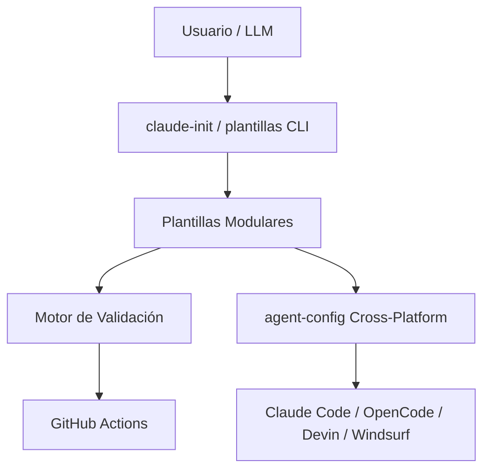

# ARCHITECTURE · Sistema de Plantillas Modulares

> **Estado**: Fase 3 completada · Bloque 2 en progreso · **Última actualización**: 2026-06-30
> **Propietario**: alexendros · **Licencia**: MIT

---

## Resumen ejecutivo

Este documento describe la arquitectura del **Sistema de Plantillas Modulares** para agentes de código (Claude Code, OpenCode, Devin, Windsurf). El sistema sigue un patrón estricto por módulo: `plantilla_X` (playbook) + `ejemplo_X` (referencia) + `validar_X.py` (validador `--strict`) + CI/CD propio.

**Objetivo**: Permitir inicializar, validar y mantener componentes de agentes de código en segundos, con calidad garantizada por validadores y CI/CD.

---

## Visión general (C4 Nivel 1)



---

## Stack tecnológico

| Capa                 | Actual                     | Bloque 2                        |
| -------------------- | -------------------------- | ------------------------------- |
| Lenguaje validadores | Python 3.12+               | Python 3.12+                    |
| Motor reusable       | `validadores/` (scripts)   | Paquete `plantillas.validators` |
| CLI                  | `claude-init` (bash)       | `plantillas` (Typer)            |
| Empaquetado          | Scripts sueltos            | `pyproject.toml` + `uv`         |
| Esquemas             | Dict/JSON                  | `pydantic` v2                   |
| Templates            | String/format              | `jinja2`                        |
| CI/CD                | GitHub Actions             | GitHub Actions (unificado)      |
| Testing              | pytest + smoke             | pytest + snapshots              |
| Linting              | ruff, yamllint, shellcheck | ruff, yamllint, shellcheck      |

---

## Estructura del repositorio (C4 Nivel 2)

```
plantillas/
├── 📄 README.md                 # Documento principal
├── 📄 INDEX.md                  # Índice maestro con estructura visual
├── 📄 ROADMAP.md                # Plan de desarrollo (Fases 1-4 + Bloque 2)
├── 📄 CHANGELOG.md              # Keep a Changelog · v1.0.0
├── 📄 ARCHITECTURE.md           # Este documento
├── 📄 CONTRIBUTING.md           # Cómo añadir módulos/validadores
├── 📄 INTEGRACION.md            # Combinar módulos entre sí
├── 📄 PROMPT_INICIO.md          # Prompt de contexto para hilos
├── 📄 CODE_OF_CONDUCT.md        # Contributor Covenant 2.1
├── 📄 LICENSE                   # MIT
├── 📄 install.sh                # Instalador 1-línea
├── 📄 update.sh                 # Actualizador idempotente
├── 📄 claude-init               # Entry point actual (bash)
├── 📄 validar_repo.py           # Validador global (legacy)
├── 📄 modules.yaml              # Catálogo central (Bloque 2)
├── 📄 pyproject.toml            # Paquete Python (Bloque 2)
├── 📁 .github/
│   ├── workflows/               # 12+ workflows CI/CD
│   └── ISSUE_TEMPLATE/          # Bug, feature, nuevo-módulo
├── 📁 validadores/              # Motor reusable (legacy + Bloque 2)
│   ├── base.py                  # BaseValidator abstracto
│   ├── checks.py                # Checks reutilizables
│   ├── reporte.py               # Formateo de resultados
│   └── registry.py              # Registry de validadores (Bloque 2)
├── 📁 tests/                    # pytest + smoke
│   ├── test_validadores.py
│   └── test_smoke.py
├── 📁 .claude/                  # Hook session-start
├── 📁 docs/                     # Documentación técnica
│   ├── adr/                     # Architecture Decision Records
│   ├── cli.md                   # CLI plantillas (Bloque 2)
│   ├── modules-yaml.md          # Esquema modules.yaml
│   ├── validators.md            # Guía motor validación
│   └── dossier-bloque2.html     # Dossier visual (no sync)
├── 📁 agents/                   # 🤖 Agentes (hub-and-spoke)
├── 📁 skills/                   # 🛠️ Skills
├── 📁 commands/                 # ⌨️ Commands
├── 📁 hooks/                    # ⚓ Hooks
├── 📁 plugins/                  # 🔌 Plugins
├── 📁 mcp/                      # 🔗 MCP Servers
├── 📁 miniapps/                 # 🖥️ Miniapps
├── 📁 agent-config/             # 🌐 Cross-platform config
├── 📁 repositorios/             # 🏛️ Repositorios GitHub
├── 📁 modulo/                   # 🧩 Meta-template
├── 📁 proyecto/                 # 📁 Template .claude/
├── 📁 estandares/               # 📐 Estándares portfolio
└── 📁 src/plantillas/           # Paquete Python (Bloque 2)
    ├── __init__.py
    ├── cli.py                   # Typer CLI
    ├── validators/              # Motor nuevo
    │   ├── __init__.py
    │   ├── base.py
    │   ├── checks.py
    │   ├── reporte.py
    │   └── registry.py
    ├── templates/               # Jinja2 templates
    └── config.py                # Pydantic schemas
```

---

## Patrones arquitectónicos

### 1. Patrón Módulo Canónico (12 módulos)

Cada módulo sigue:

- **Plantilla** (`plantilla_X/`) → Playbook con placeholders `[ASÍ]`
- **Ejemplo** (`ejemplo_X/`) → Referencia funcional sin placeholders
- **Validador** (`validar_X.py`) → Hereda `BaseValidator`, usa checks reutilizables
- **CI/CD** (`.github/workflows/validar-X.yml`) → Descubre ejemplos, ejecuta `--strict`

### 2. Motor de Validación Reusable

```
BaseValidator (abstracto)
    ├── checks = [Check(nombre, método)]
    ├── validate() → ejecuta checks, retorna (ok, resultados)
    └── --strict → warnings = errores
Checks reutilizables (validadores/checks.py):
    ├── check_estructura()        # Archivos/directorios requeridos
    ├── check_placeholders()      # Detecta [PLACEHOLDER] no resueltos
    ├── check_contenido_minimo()  # Longitud/keywords mínimas
    ├── check_yaml_valido()       # YAML parseable
    ├── check_json_valido()       # JSON parseable
    ├── check_referencias()       # Links a docs oficiales
    └── check_frontmatter()       # YAML frontmatter en manifests
```

### 3. Catálogo Central (`modules.yaml`) — Bloque 2

Fuente de verdad única para:

- CI/CD (descubre módulos dinámicamente)
- Tests (itera módulos)
- CLI `plantillas config list`
- Pre-commit hooks

```yaml
modules:
  - name: agentes
    type: single-file
    validator: plantillas.validators.agentes.AgentesValidator
    template: agentes/plantilla_agentes
    example: agentes/ejemplo_agentes
    workflow: .github/workflows/validar-agentes.yml
  # ... 11 módulos más
```

### 4. Configuración Cross-Platform (`agent-config/`)

Genera configs idénticas para 4 targets desde esquema Pydantic único:

- **Claude Code** → `~/.claude/` + `.claude/` local
- **OpenCode** → `~/.config/opencode/` + `.opencode/`
- **Devin** → `~/.config/devin/` + `.devin/`
- **Windsurf** → `~/.codeium/windsurf/` + `.windsurf/`

Templates Jinja2 por target → salida idéntica semánticamente.

---

## Flujo de datos (C4 Nivel 3)

### Inicialización (Modo Actual)

```
claude-init --modulo agentes --nombre mi-agente
    │
    ├─► cp -r plantilla_agentes/ ~/.claude/agents/mi-agente/
    │
    ├─► Reemplaza placeholders [NOMBRE] → mi-agente
    │
    └─► python agentes/validar_agente.py ~/.claude/agents/mi-agente --strict
```

### Validación (Unificada)

```
plantillas validate --all --strict
    │
    ├─► Lee modules.yaml
    ├─► Para cada módulo:
    │     ├─► Descubre ejemplos
    │     ├─► Instancia validador del registry
    │     └─► Ejecuta validate() → (ok, resultados)
    │
    └─► Agrega resultados → reporte consolidado
```

### CI/CD Pipeline

```
push/PR → GitHub Actions
    ├─► ci-global.yml        → lint global (ruff, yamllint, shellcheck, markdownlint)
    ├─► pr-guardian.yml      → Conventional Commits, tamaño, archivos protegidos
    ├─► security-scan.yml    → Secrets, tokens, archivos prohibidos
    ├─► validar-todos.yml    → Valida TODOS los ejemplos de TODOS los módulos
    ├─► validar-<modulo>.yml → Valida ejemplos de módulo específico
    └─► release.yml          → Semver, tag, release notes (si main)
```

---

## Decisiones de arquitectura (ADRs)

| ADR | Título                                                   | Estado      | Ubicación                            |
| --- | -------------------------------------------------------- | ----------- | ------------------------------------ |
| 001 | Patrón módulo canónico (plantilla + ejemplo + validador) | Aceptado    | `docs/adr/001-modulo-canonico.md`    |
| 002 | Motor de validación reusable con BaseValidator           | Aceptado    | `docs/adr/002-motor-validacion.md`   |
| 003 | Catálogo central `modules.yaml` como fuente de verdad    | Aceptado    | `docs/adr/003-modules-yaml.md`       |
| 004 | Configuración cross-platform Pydantic + Jinja2           | Aceptado    | `docs/adr/004-agent-config.md`       |
| 005 | CLI unificado Typer (`plantillas`)                       | Aceptado    | `docs/adr/005-cli-plantillas.md`     |
| 006 | Transición legacy scripts → paquete Python instalable    | En progreso | `docs/adr/006-transicion-bloque2.md` |

---

## Calidad y métricas

| Métrica                | Actual | Meta  |
| ---------------------- | ------ | ----- |
| Módulos canónicos      | 12     | 12    |
| Módulos con validador  | 12/12  | 12/12 |
| Módulos con CI/CD      | 12/12  | 12/12 |
| Ejemplos por módulo    | ≥2     | ≥2    |
| Tests passing          | 100%   | 100%  |
| Documentación completa | 100%   | 100%  |
| CLI usable (Bloque 2)  | ✅     | ✅    |

---

## Seguridad

- **No secrets en repo** → `security-scan.yml` + pre-commit `detect-private-key`
- **Tokens GitHub** → Solo vía `GITHUB_TOKEN` en Actions, nunca en repo
- **Dependencies** → `dependabot.yml` semanal, `ruff` + `pytest` en CI
- **Branch protection** → main protegida (PR + review + checks verdes)

---

## Operación

### Despliegue

- **Actual**: `install.sh` → clona a `~/.claude/plantillas`
- **Bloque 2**: `uv pip install -e .` → `plantillas` CLI global

### Monitoreo

- **CI badge** en README por módulo
- **Link check** semanal (`.github/workflows/link-check.yml`)
- **Security scan** en cada PR (`security-scan.yml`)

### Mantenimiento

- **Dependabot** semanal → auto-merge si CI pasa
- **Link check** semanal
- **ADR review** trimestral
- **CHANGELOG** por release (Keep a Changelog)

---

## Referencias

- [README.md](./README.md) — Documento principal
- [ROADMAP.md](./ROADMAP.md) — Plan de desarrollo
- [INDEX.md](./INDEX.md) — Índice maestro visual
- [CHANGELOG.md](./CHANGELOG.md) — Historial de versiones
- [CONTRIBUTING.md](./CONTRIBUTING.md) — Cómo añadir módulos
- [INTEGRACION.md](./INTEGRACION.md) — Combinar módulos
- [PROMPT_INICIO.md](./PROMPT_INICIO.md) — Prompt de contexto
- [docs/adr/](./docs/adr/) — Architecture Decision Records
- [docs/dossier-bloque2.html](./docs/dossier-bloque2.html) — Dossier visual Bloque 2
