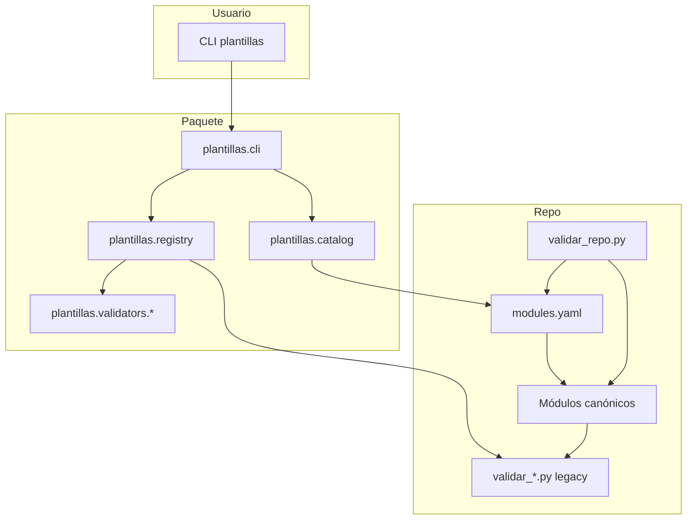
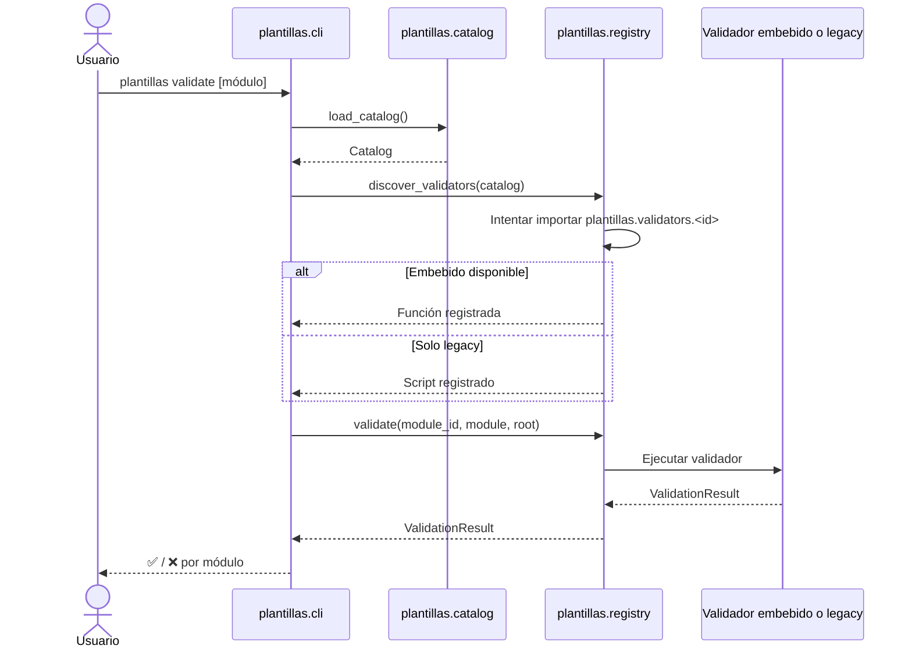
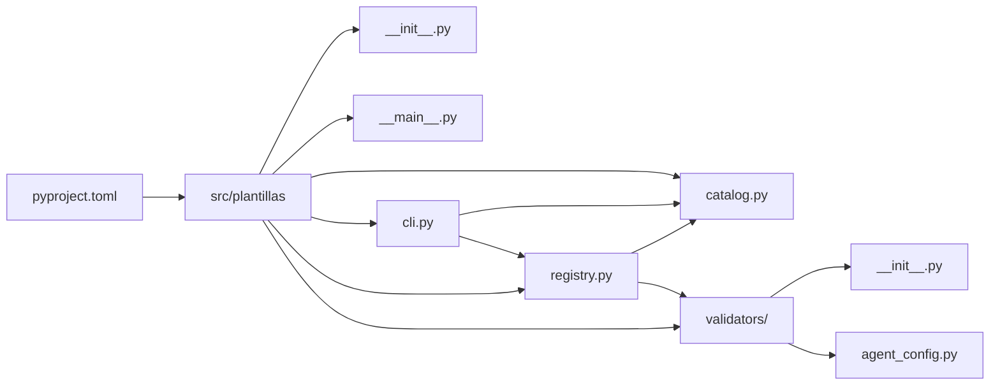
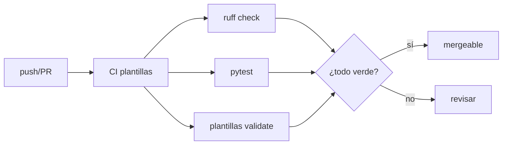

# Diagramas de arquitectura del Bloque 2

Vista gráfica del paquete `plantillas`, su catálogo y el flujo de validación.

## 1. Arquitectura general



## 2. Flujo de validación



## 3. Estructura del paquete



## 4. Mapa de módulos

```markdown
- Sistema de Plantillas
  - Bloque 2
    - Paquete Python
      - CLI `plantillas`
      - Catálogo `modules.yaml`
      - Registry de validadores
    - Módulos canónicos
      - agent-config
      - agentes
      - artefactos
      - commands
      - estandares
      - hooks
      - mcp
      - miniapps
      - modulo
      - plugins
      - proyecto
      - repositorios
      - skills
    - Documentación
      - ADRs
      - CLI
      - modules-yaml
      - validators
```

## 5. Pipeline de calidad


