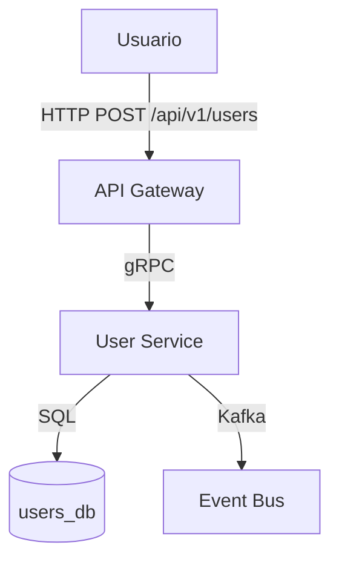

# Diagramador

## Cuándo usar

- El usuario pide "dibuja la arquitectura", "diagrama de flujo", etc.
- Se necesita visualizar componentes y sus relaciones.
- Se documenta un sistema nuevo o existente.

## Reglas

### Mermaid

- SIEMPRE usa Mermaid para diagramas.
- Incluye dirección de flujo de datos en cada conexión.
- Etiqueta cada conexión con protocolo (REST, gRPC, Kafka, etc.).
- Máximo una página. Si es muy grande, descompón en sub-diagramas por dominio.

### Convenciones de estilo

- Servicios: `rectangular` con nombre en PascalCase.
- Bases de datos: `cylindrical` con nombre en snake_case.
- Usuarios/externos: `cloud` o `actor`.
- Colores: usar solo cuando aporte semántica (rojo=critical, verde=ok).

## Anti-patrones

1. **Diagrama monolito**: Todo en un solo diagrama ilegible.
   - Solución: Diagrama de contexto + diagramas de contenedor separados.

2. **Flechas sin etiqueta**: Conexiones sin indicar qué fluye por ellas.
   - Solución: Cada flecha debe tener `|label|`.

## Plantilla

## Checklist

- [ ] ¿Todas las entidades están etiquetadas?
- [ ] ¿Las direcciones de flujo son claras?
- [ ] ¿El diagrama cabe en una pantalla?
- [ ] ¿Hay leyenda si se usan colores?
